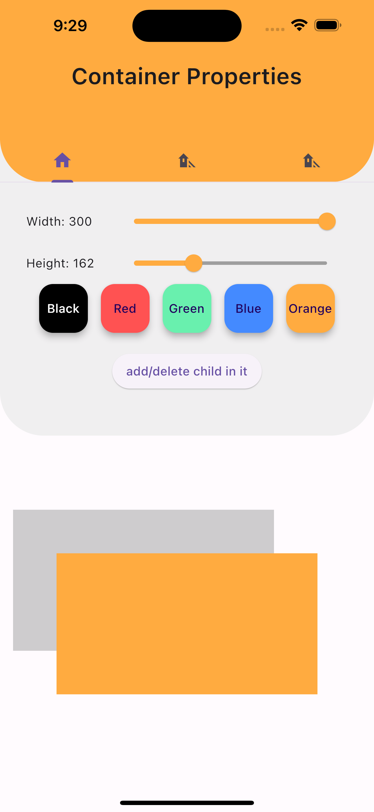
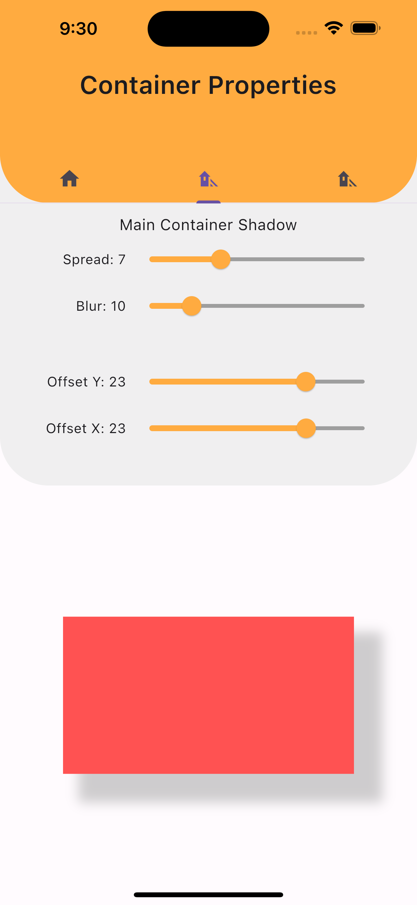
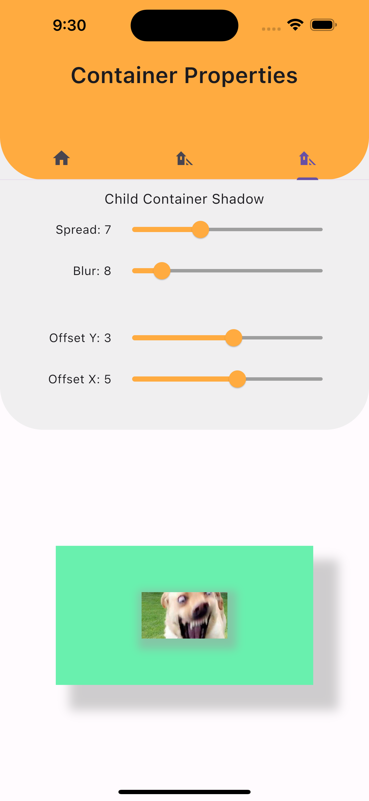
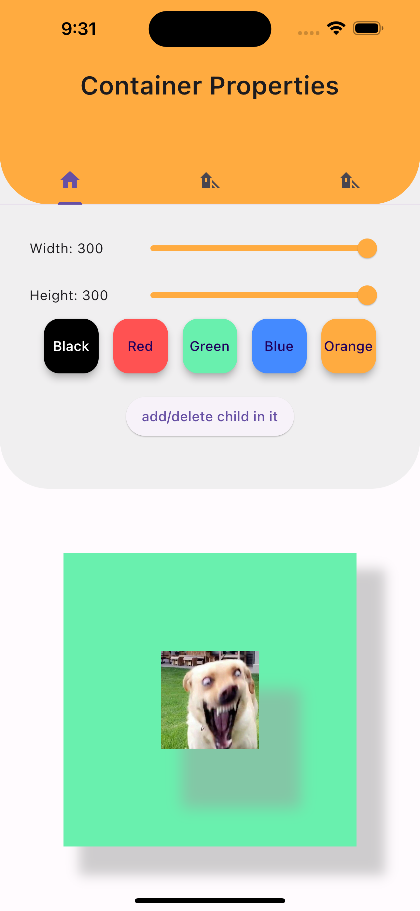

# Container Shadow

I made this app to look at when I am making an application and need help for box shadows. I hope it helps others too.

## Screenshots
(screen shots do not include the last commit which is related with border radius.
### First Screen

| First Screen       |  First Screen          |
| ------------- |:-------------:|
|      |  |

### Second and Third Screen

| Second Screen       |  Third Screen          |
| ------------- |:-------------:|
|      |  |
